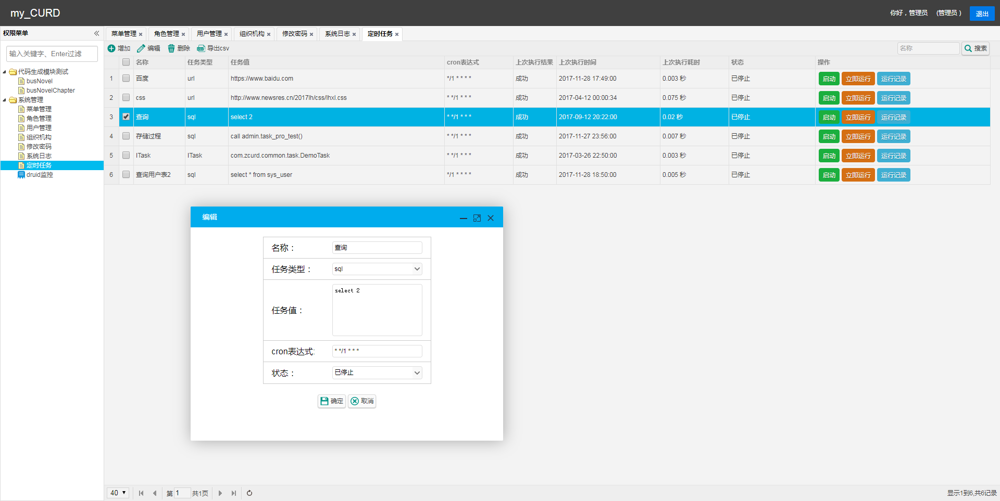
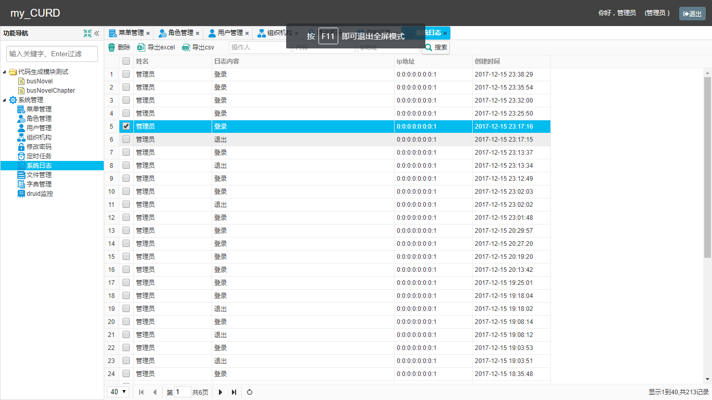
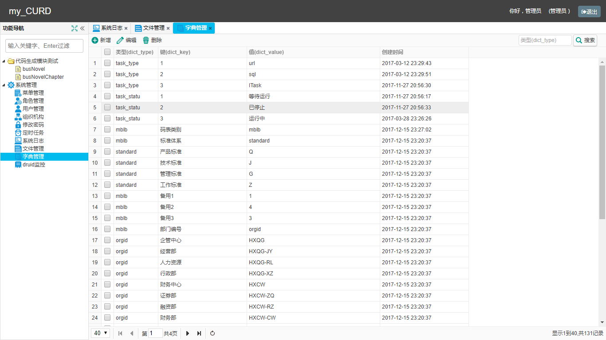
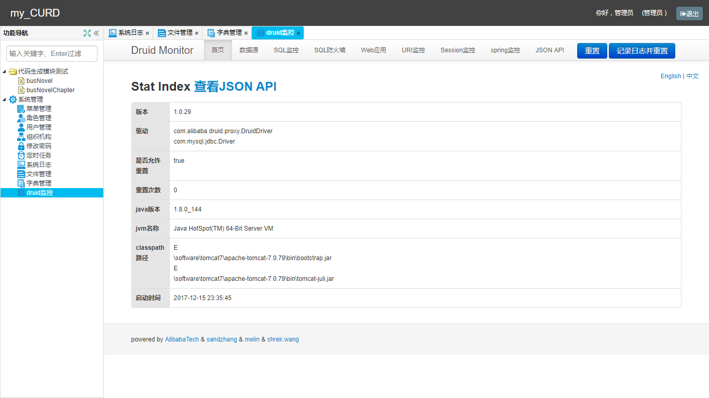

### 基于JFinal3.2 和 Easyui11.5.3 实现的 权限管理系统
#### （页面级权限 ; 单表代码生成器）

1. 登录

2. 菜单 (权限管理)

3. 角色

4. 用户

5. 组织机构

6. 任务

7. 系统日志

8. 文件管理

9. 字典管理

10. druid 监控

11. 代码生成器  
通过配置文件generator.properties，运行main 方法，一键生成 model、controller、view 代码，可实现单表的curd 操作（excel导入导出可选）
```properties
# 基础包名
basePackageName=com.hxkj
# 模块名
moduleName=bus
# 需要生成代码的表(多张表以 ; 分割)
tables=bus_novel_chapter
com.hxkj.common.util.generator.tpl
tplDir=tpl
```
