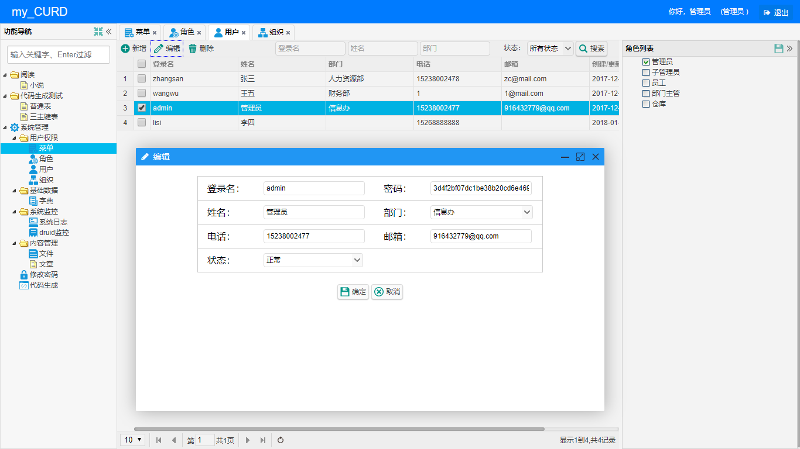
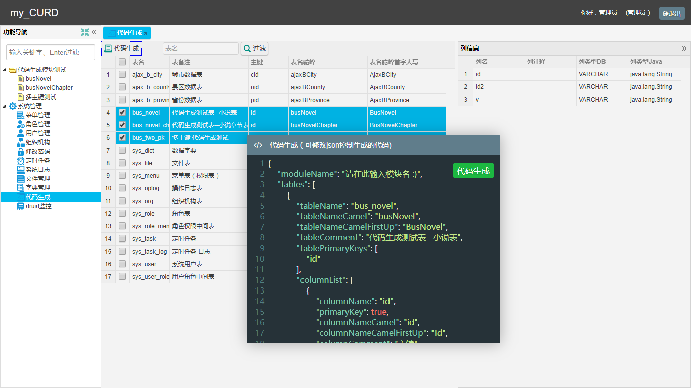

  

  
  

### 简介 | Intro  

表格型内容管理系统，内置代码生成器，可用于业务逻辑快速开发。

### 优点 | Advantages  

- **轻量**：Jfinal、Easyui、Mysql5.7。
- **清晰**：系统分多个子模块，每个模块下分为model、controller、service 子包 和 相应页面模板。
- **快速**：前后端封装（弹窗、Tab切换、数据筛选过滤器、excel 导入导出、数据处理等）；页面级别权限管理、灵活的代码生成器。

### 文档 | Documentation
[项目结构](https://github.com/qinyou/my_curd/wiki/%E9%A1%B9%E7%9B%AE%E7%BB%93%E6%9E%84%E3%80%81%E4%BB%A3%E7%A0%81%E8%AF%B4%E6%98%8E)  
[代码生成器，一键生成model、controller、view](https://github.com/qinyou/my_curd/wiki/%E4%BB%A3%E7%A0%81%E7%94%9F%E6%88%90%E5%99%A8%E4%BD%BF%E7%94%A8%E6%96%B9%E6%B3%95)

### 截图 | preview  

### 开发这个项目的一些问题记录 
1. jfinal 的日志工具使用log4j 就好，使用其它的可能是给自己找麻烦（使用slf4j后发现让人难受的问题)。 