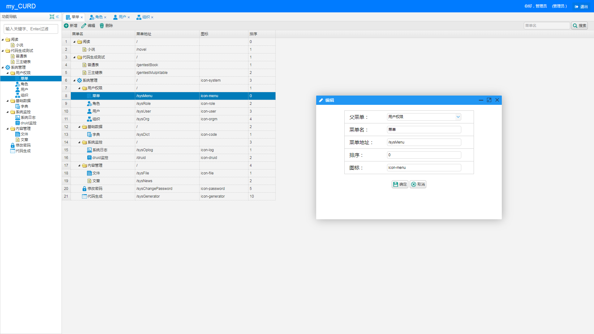
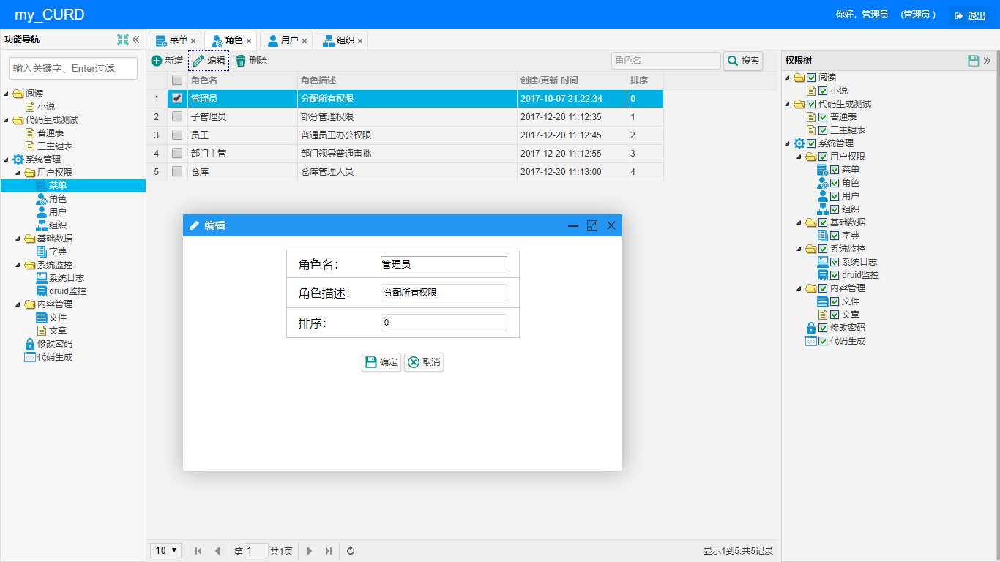
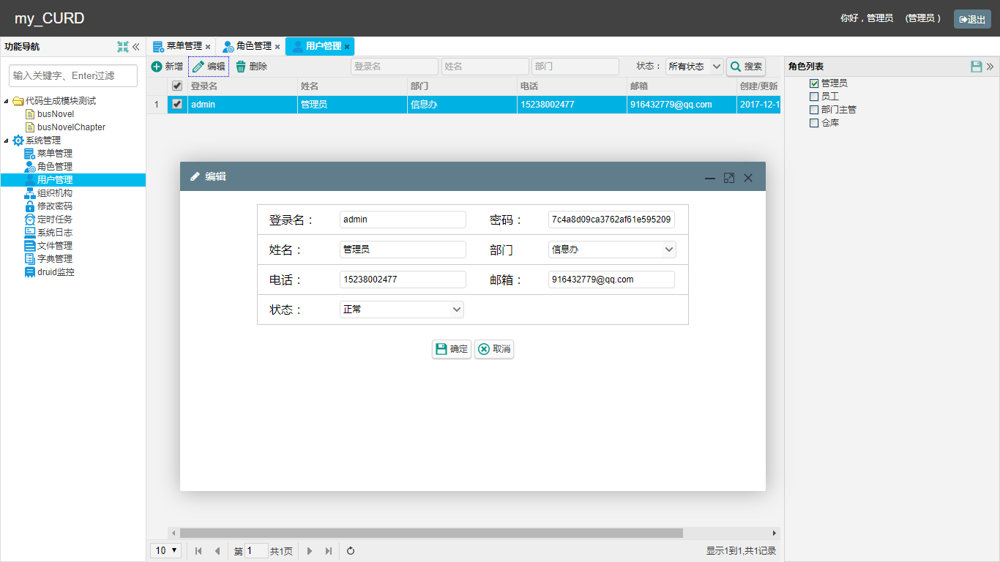
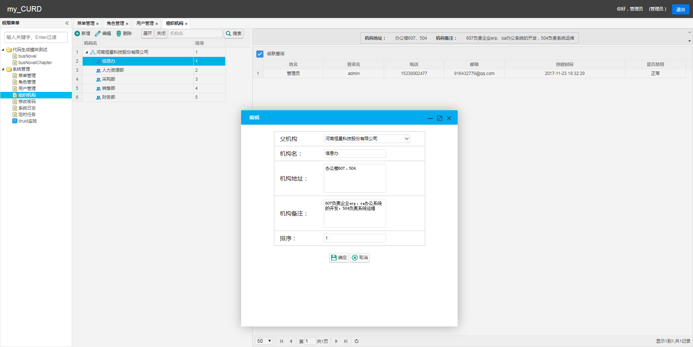
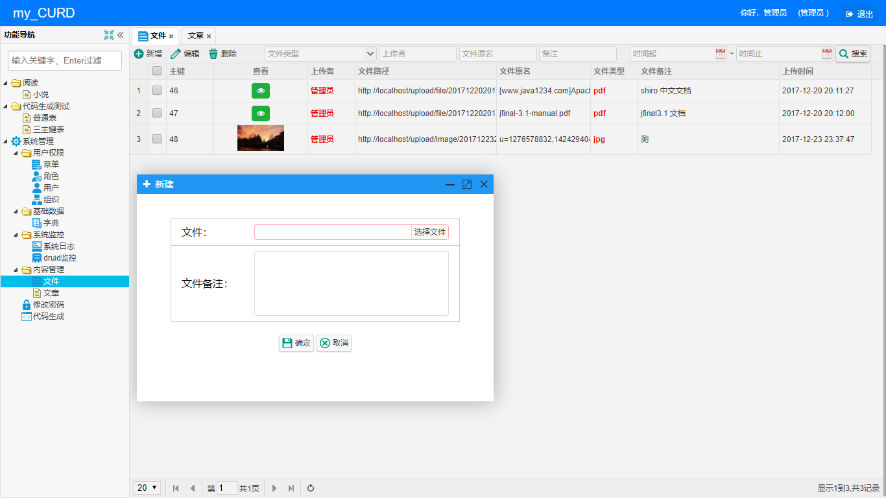
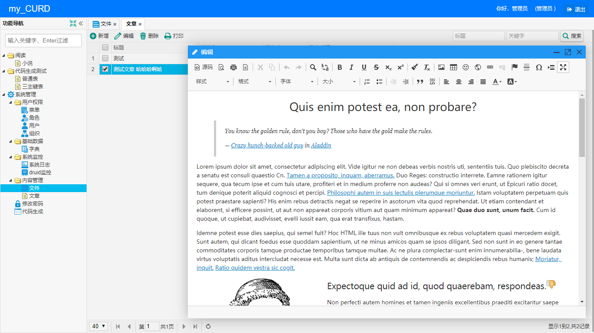
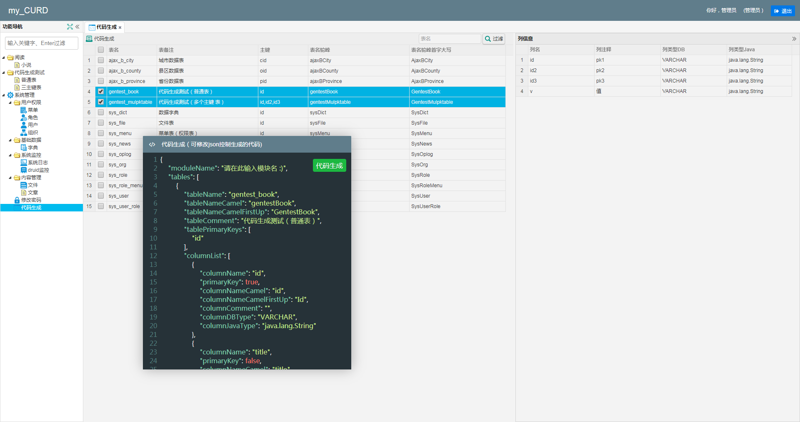
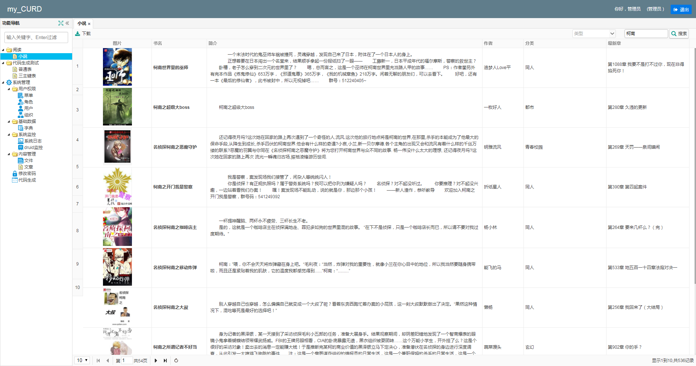

# 简介
内容管理、权限控制、代码生成器。  业务系统快速开发框子.

# 特点
- **轻量**：Jfinal(mvc+orm)、Easyui(前端UI)、Mysql5.7，都是些简单靠谱的东西。
- **清晰**：系统分多模块，每个模块下分为model、controller、service 和相应的 视图模板，controller包含CURD路由。
 项目架构清晰，控制方便。
- **快速**：前端封装（弹窗、Tab切换、树形结构数据处理等）、后端封装（数据筛选过滤器、excel 导入导出、数据处理等）、
页面级别权限管理、灵活的代码生成器。
一分钟就可做出可用的业务功能(单表增删改查导入导出)。

### 一些简单说明 
[项目结构、代码说明](https://github.com/qinyou/my_curd/wiki/%E9%A1%B9%E7%9B%AE%E7%BB%93%E6%9E%84%E3%80%81%E4%BB%A3%E7%A0%81%E8%AF%B4%E6%98%8E)  
[权限控制（未写）](https://github.com/qinyou/my_curd/wiki)  
[代码生成器使用步骤](https://github.com/qinyou/my_curd/wiki/%E4%BB%A3%E7%A0%81%E7%94%9F%E6%88%90%E5%99%A8%E4%BD%BF%E7%94%A8%E6%96%B9%E6%B3%95)

### 系统的一些截图

